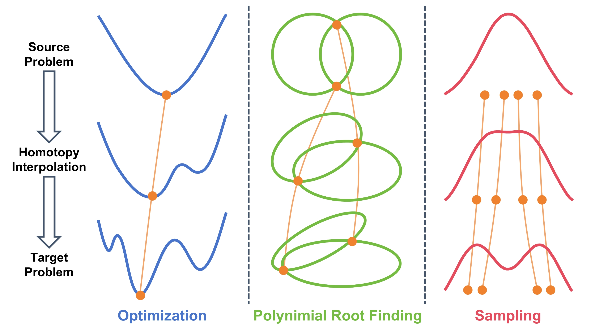

# Neural Predictor-Corrector (NPC)

[](https://arxiv.org/abs/2602.03086)
[](https://www.python.org/)
[](https://opensource.org/licenses/MIT)

## Introduction

This is the official repository for the paper [Neural Predictor-Corrector: A General Learning Framework for Homotopy Methods](https://arxiv.org/abs/2602.03086).

Homotopy methods provide a powerful paradigm for solving challenging problems across robust optimization, global optimization, polynomial root-finding, and sampling. While practical solvers typically follow a **predictor-corrector (PC)** structure, they rely on hand-crafted heuristics for step sizes selection and termination criteria, which are often suboptimal and task-specific.


This repository implements **Neural Predictor-Corrector (NPC)** , a unified neural solver that **replaces hand-crafted heuristics with automatically learned policies** using reinforcement learning. Our method:

- Unifies diverse homotopy problems under a single framework  
- Learns efficient predictor-corrector policies via RL  
- Outperforms baselines in efficiency & stability  
- Generalizes to unseen instances without retraining

Development credit for this repository goes primarily to [@maijiayao1](https://github.com/maijiayao1) and [@bangyan101](https://github.com/bangyan101).

### **Video**

[](https://www.youtube.com/watch?v=7rjERHpgEYw) &nbsp;&nbsp;


---

## Installation

First, clone the repository and install dependencies:

```bash
# clone project
git clone git@github.com:maijiayao1/NPC.git
cd NPC

# install requirements
pip install -r requirements.txt
```

---

## Usage

To train a new model:

```
python script/GNC_PPO_training.py  --model-save-path="model/your_model_name"
```

Launch TensorBoard to visualize training logs:

```
tensorboard --logdir=./logs/ppo_gnc_tensorboard
```

Then open http://localhost:6006 in your browser.


Evaluate a trained model:

```
python script/GNC_PPO_inference.py --model-save-path="model/your_model_name"
```

---

## Citations

If this codebase is useful towards other research efforts please consider citing us.

```
@article{mai2026neural,
  title={Neural Predictor-Corrector: Solving Homotopy Problems with Reinforcement Learning},
  author={Mai, Jiayao and Liao, Bangyan and Zhao, Zhenjun and Zeng, Yingping and Li, Haoang and Civera, Javier and Wu, Tailin and Zhou, Yi and Liu, Peidong},
  journal={arXiv preprint arXiv:2602.03086},
  year={2026}
}
```

---
## Licences

This repo is licensed under the [MIT License](https://opensource.org/license/mit/).