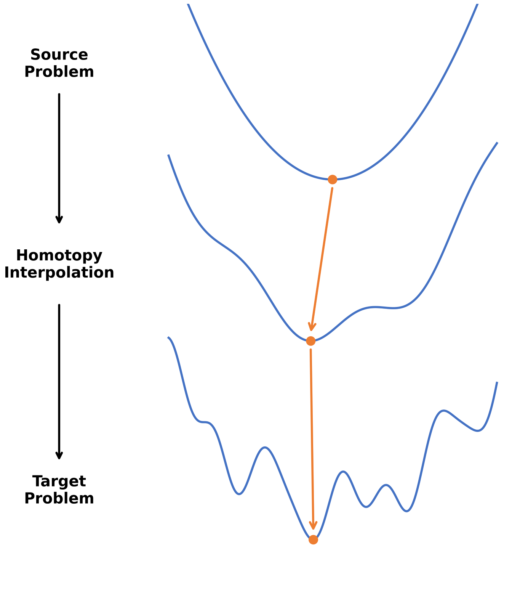
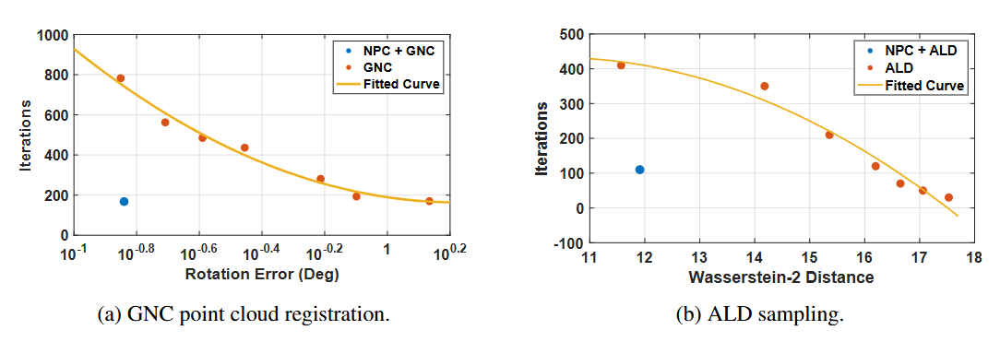

<p align="center">
  <h1 align="center">
    <ins>Neural Predictor-Corrector (NPC)</ins> 🔄<br>
    Solving Homotopy Problems with Reinforcement Learning
  </h1>
  <h3 align="center">ICLR 2026</h3>
  <p align="center">
    <a href="https://github.com/maijiayao1">Jiayao Mai</a><sup>*</sup>&nbsp;&nbsp;
    <a href="https://bangyan101.github.io/">Bangyan Liao</a><sup>*</sup>&nbsp;&nbsp;
    <a href="https://ericzzj1989.github.io/">Zhenjun Zhao</a><sup>†</sup>&nbsp;&nbsp;
    <a href="https://www.linkedin.com/in/zengyingping/">Yingping Zeng</a>
    <br>
    <a href="https://sites.google.com/view/haoangli/homepage">Haoang Li</a>&nbsp;&nbsp;
    <a href="https://scholar.google.es/citations?user=j_sMzokAAAAJ&hl=en">Javier Civera</a>&nbsp;&nbsp;
    <a href="https://tailin.org/">Tailin Wu</a>&nbsp;&nbsp;
    <a href="https://sites.google.com/view/zhouyi-joey/home">Yi Zhou</a><sup>✉</sup>&nbsp;&nbsp;
    <a href="https://ethliup.github.io/">Peidong Liu</a><sup>✉</sup>
  </p>
  <p align="center">
    <sup>*</sup>Equal contribution &nbsp;·&nbsp; <sup>†</sup>Project lead &nbsp;·&nbsp; <sup>✉</sup>Corresponding authors
  </p>
  <div align="center">

  [](https://arxiv.org/abs/2602.03086)
  [](https://youtu.be/7rjERHpgEYw)
  [](files/npc_slides.pdf)
  [](files/npc_poster.pdf)
  [](https://www.python.org/)
  [](LICENSE)

  </div>
</p>

Official implementation of the ICLR 2026 paper:
**"Neural Predictor-Corrector: Solving Homotopy Problems with Reinforcement Learning"**

<p align="center">
  <a href="https://arxiv.org/abs/2602.03086">
    
  </a>
  <br>
  <em>NPC reveals that robust optimization, global optimization, polynomial root-finding, and sampling all share a common predictor-corrector structure, and learns efficient solver policies via reinforcement learning.</em>
</p>

---

## 🔍 Overview

Homotopy methods are ubiquitous across scientific computing, from **Graduated Non-Convexity (GNC)** in robust optimization to **annealed Langevin dynamics** in sampling. Despite their apparent diversity, these methods all follow a common **predictor-corrector (PC)** structure. Yet practical solvers rely on hand-crafted heuristics for step size selection and termination criteria, which are often suboptimal and require tedious per-task tuning.

**NPC (Neural Predictor-Corrector)** is the first unified framework that:
1. Reveals the shared predictor-corrector structure underlying these diverse homotopy problems
2. Replaces hand-crafted heuristics with **learned policies trained via reinforcement learning (PPO)**

At each homotopy level, NPC:
- **Observes** the current homotopy level, corrector statistics, and convergence velocity
- **Decides** the predictor step size and corrector tolerance
- **Learns** to optimally balance accuracy and efficiency across problem classes

## ✨ Highlights

- 🔗 **First unified framework** for homotopy methods spanning robust optimization, global optimization, polynomial root-finding, and sampling
- 🤖 **RL-based policy learning** via PPO replaces all hand-crafted predictor-corrector heuristics
- ✅ **No per-instance tuning** trains once on a problem class and generalizes to unseen instances
- 🚀 **State-of-the-art efficiency** with superior stability across all benchmarks

## 🎬 Video

<p align="center">
  <a href="https://www.youtube.com/watch?v=7rjERHpgEYw">
    
  </a>
</p>

---

## 📦 Installation

Clone the repository and install dependencies:

```bash
git clone git@github.com:maijiayao1/NPC.git
cd NPC
pip install -r requirements.txt
```

---

## 🚀 Usage

### Training

Train a new NPC model on a target problem class:

```bash
python script/GNC_PPO_training.py --model-save-path="model/your_model_name"
```

Monitor training with TensorBoard:

```bash
tensorboard --logdir=./logs/ppo_gnc_tensorboard
```

Then open http://localhost:6006 in your browser.

### Evaluation

Evaluate a trained model:

```bash
python script/GNC_PPO_inference.py --model-save-path="model/your_model_name"
```

---

## 📊 Results

NPC achieves consistent speedups across all benchmark tasks. See the [paper](https://arxiv.org/abs/2602.03086) for the full evaluation.

### Point Cloud Registration via Graduated Non-Convexity (GNC)

Rotation error (log E_R) and translation error (log E_t) are reported on a log₁₀ scale. NPC matches classical accuracy while reducing iterations and runtime by **4–10×**.

| Sequence | Method | log(E_R) ↓ | log(E_t) ↓ | Iter | Time (s) |
|:--------:|:-------|:----------:|:----------:|-----:|---------:|
| bunny    | Classic GNC | -0.85 | -2.76 | 783 | 161.00 |
|          | IRLS GNC    | -0.85 | -2.75 | 309 |  61.59 |
|          | **NPC + GNC** | -0.85 | -2.71 | **169** | **19.15** |
| cube     | Classic GNC | -1.12 | -2.89 | 486 |  89.34 |
|          | IRLS GNC    | -1.10 | -2.90 | 141 |  26.13 |
|          | **NPC + GNC** | -1.11 | -2.86 | **86** | **7.86** |
| dragon   | Classic GNC | -0.80 | -2.82 | 859 | 177.11 |
|          | IRLS GNC    | -0.80 | -2.82 | 486 |  95.93 |
|          | **NPC + GNC** | -0.80 | -2.80 | **201** | **26.42** |

> NPC is trained on the Aquarius sequence and evaluated on unseen sequences (zero-shot generalization).

### Efficiency vs. Precision Trade-off

<p align="center">
  
  <br>
  <em>NPC consistently achieves a better trade-off between efficiency (fewer iterations) and precision across all four task domains.</em>
</p>

---

## 🗃️ Code Structure

```
NPC/
├── assets/                     # Figures and teaser image
├── files/                      # Slides and poster (PDF)
├── Environment/
│   ├── GNC_CostFactor_PointCloudRegistration.py
│   ├── GNC_Env.py
│   └── point_cloud_registration_utils.py
├── script/
│   ├── GNC_PPO_training.py     # Training script
│   └── GNC_PPO_inference.py    # Evaluation script
├── model/                      # Saved model checkpoints
└── requirements.txt
```

---

## 📝 Citation

If you find this work useful, please consider citing:

```bibtex
@article{mai2026neural,
  title={Neural Predictor-Corrector: Solving Homotopy Problems with Reinforcement Learning},
  author={Mai, Jiayao and Liao, Bangyan and Zhao, Zhenjun and Zeng, Yingping and Li, Haoang and Civera, Javier and Wu, Tailin and Zhou, Yi and Liu, Peidong},
  journal={arXiv preprint arXiv:2602.03086},
  year={2026}
}
```

---

## 📬 Contact

For questions or feedback, feel free to reach out:

- [Jiayao Mai](https://github.com/maijiayao1)
- [Bangyan Liao](https://bangyan101.github.io/)
- [Zhenjun Zhao](https://ericzzj1989.github.io/)
